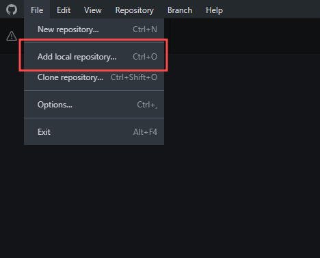
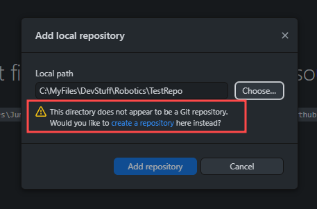
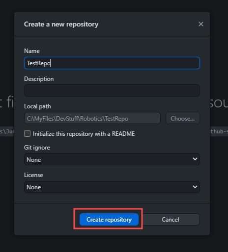
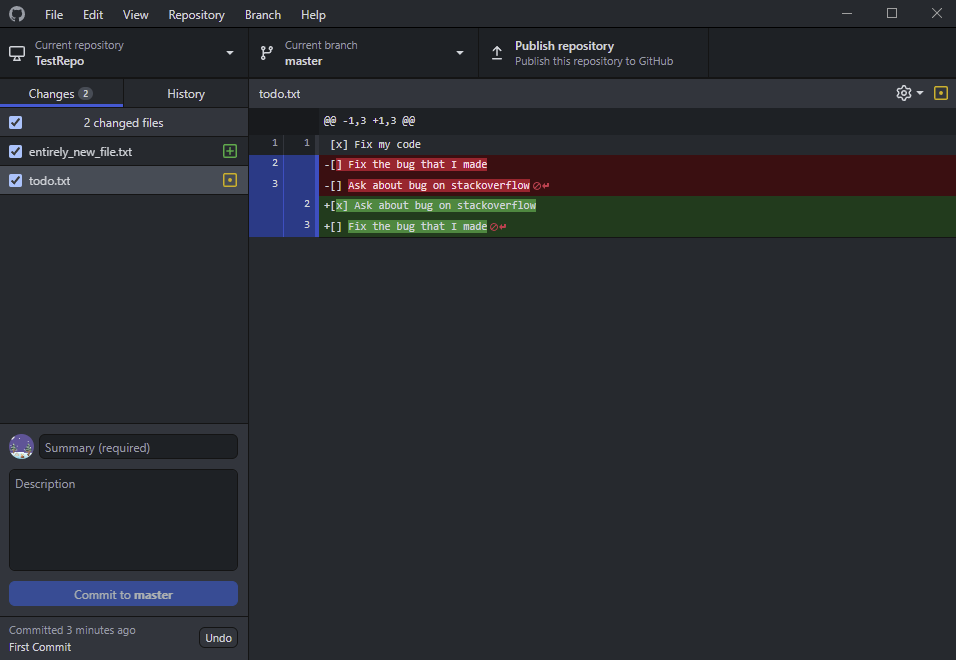
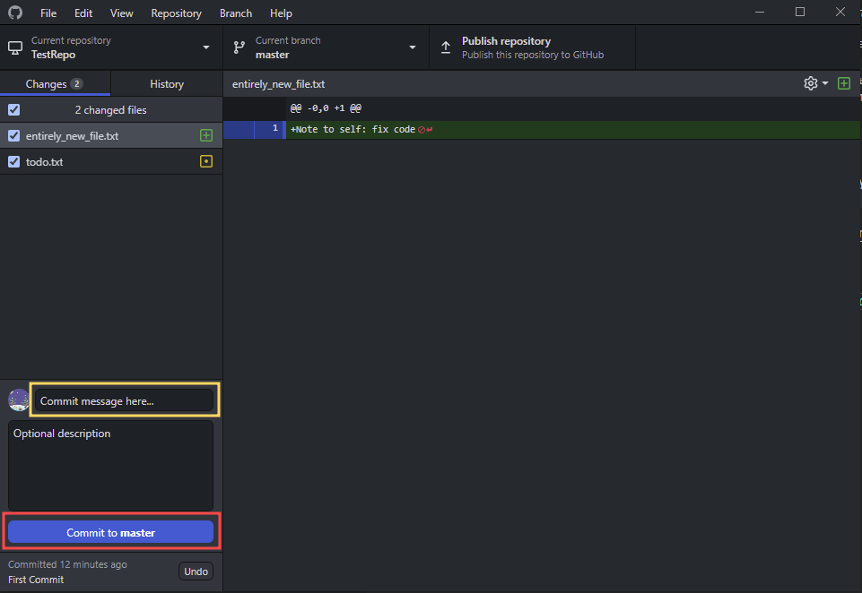

# Git Part 1 - Basics
## About Git
Git is an open-source version control system. Git is used to track changes to projects on a file-by-file scale. This allows you to collaborate much easier as any updates you push only push the files you change, meaning multiple people can make changes as long as they are in different files without any issues, and allows you fix and merge any issues if you do edit the same files.

## Installing and Using
Git is available on almost every operating system, and can be downloaded with instructions for each OS here: [Git Download](https://git-scm.com/downloads)

Git is a CLI (Command Line Application) meaning the core program is just made for the terminal, but there are quite a few free GUI (Graphical User Interface) based wrappers for Git, which may make it easier to learn for beginners. For this I am going recommend using GitHub desktop as it integrates nicely with GitHub (talked about later) which we use to host our codebase. GitHub Desktop is available here: [Github Desktop Download](https://desktop.github.com/)

# Usage
## Index
- Adding Git to a project
  - [Git CLI](#git-cli)
  - [GitHub Desktop](#github-desktop)
- Tracking changes & Committing code
  - [Git CLI](#git-cli-1)
  - [GitHub Desktop](#github-desktop-1)

---

## Adding Git to a project
To add Git to a project (mainly referred to as initializing git) is what allows git to work in your project.

### Git CLI
To add git to a project with the Git CLI, open your terminal and set your directory to the root folder you want to make a git repository. This can be done using `cd path/to/your/project` the 'cd' command will set your terminal to run commands in the path that you selected. 

In order to initialize your project, run `git init` the 'git' command runs git, and the 'init' part is a subcommand, which tells git to initialize git in the current path.

### GitHub Desktop
To add git to a project with GitHub Desktop, launch GitHub Desktop and click `File > Add local repository`

When it pops up with a window, click `Choose...`, then navigate to and select the directory you would like to initialize the Git repository in. This feature can also be used to bring a existing Git repository into GitHub Desktop.

If Git has not been initialized in the directory you selected, it will ask if you want to create one

Once you click on `create a repository` it will open up with another menu

After pressing the `Create repository`button and waiting little bit it should tell you it has been initialized and now you have a Git repository.

---

## Tracking changes & Committing code
The main use of Git is for its ability to track changes to code. The primary function behind this is called committing code. 

A commit stores the changes made to tracked files under a commit (think of it like a snapshot of your code). By default when you edit, create, or delete a file, Git does not see it. In order to commit a file you need to tell Git what files you have edited. On GitHub Desktop, this is done by default when you go to commit changes.

### Git CLI
Once you have made changes and would like to commit them, open a terminal session in your current working directory. If you are unsure of what files need to be added, you can run the `git status` command. This will tell you what has been modified. 

If you would like to add all changed files to the index before committing, you can run `git add .` the subcommand 'add' tells Git to index the files inputted, with the dot meaning all the files in the current working directory. If you would like to add only specific files for more control, you can specify those instead of '.'

Once the changes have been indexed with 'add', committing them is simple, just run `git commit -m "<Your Message>"` the subcommand 'commit' is used to make the changes, with the argument '-m' passes the message in double quotes as your commit message (If you forgot to use '-m' it will open the message in the vi text editor, which can be confusing to use, so just remember typing :q in vi will allow you to exit), after you run this the commit is made.

## GitHub Desktop
Once you have made changes and would like to commit them, make sure github desktop is open. You should see an overview, which shows you info about your current repository, latest commit, and current changes as well a diff log for each file

Once you have made sure you have all the changes you want and would like to commit, you need to write a summary / commit message, and if you want a more detailed description. then, press the blue `Commit to <branch>` button

After this your files are added and your changes are committed.

---

### Up Next >> [Part 2](./git_part_2.md)