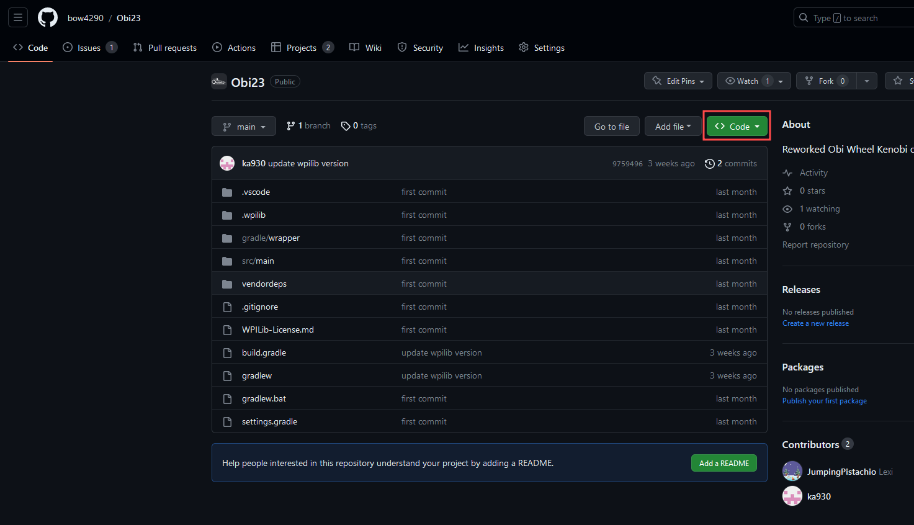
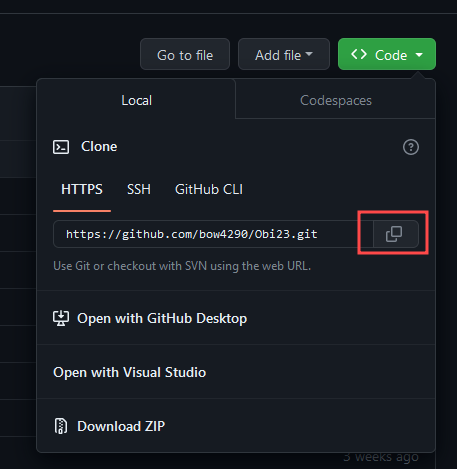
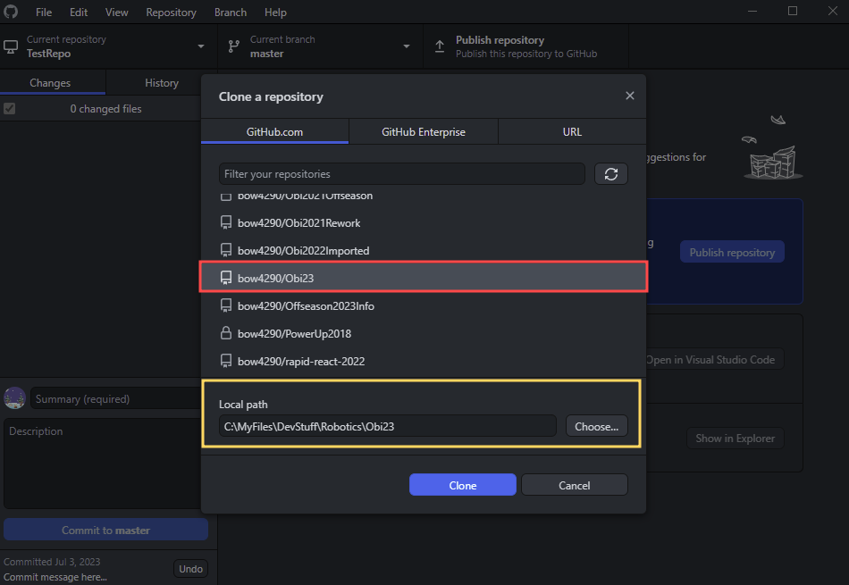
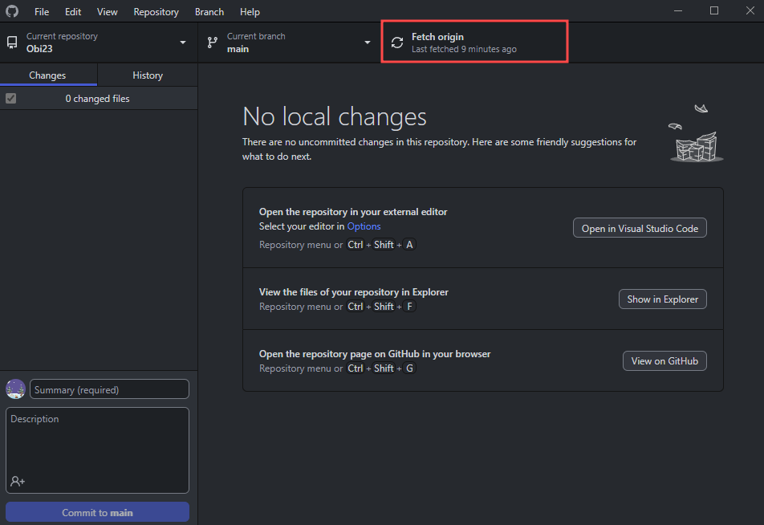
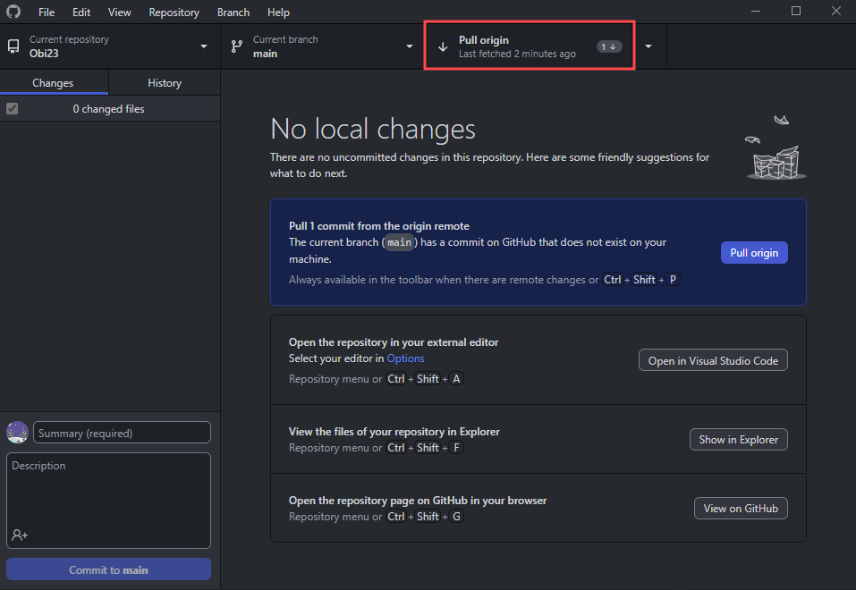
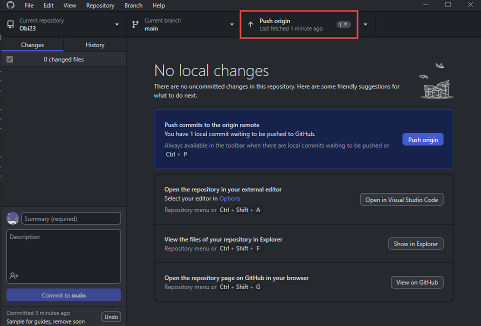

# Git Part 2 - Remote Repositories
*Everything talked about in this guide builds upon what was learned in the [Git Part 1](./git_part_1.md). it is recommended to follow that before this guide.*

## Preface
So far this guide has only discussed working with local repositories, but one of the main uses of Git is collaborative workspaces. Two keywords to remember are local (referring to repositories stored on a local computer hard-drive), and remote (referring to repositories stored on a remote server and accessed with HTTPS or SSH).

The platform we use to store our repositories is called GitHub ([Link here](https://github.com/))m so we will be working with that in this guide, although most of the knowledge should be applicable to other platforms.

# Usage
## Index
- [Cloning Repositories](#cloning-repositories)
  - [Git CLI + GitHub Website](#git-cli--github-website)
  - [GitHub Desktop](#github-desktop)
- Managing Remote Repositories
  - [Fetch Status](#managing-changes-to-remote-repositories---fetch--status)
    - [Git CLI](#git-cli)
    - [GitHub Desktop](#github-desktop-1)
  - [Pull Changes](#managing-changes-to-remote-repositories---pulling-changes)
    - [Git CLI](#git-cli-1)
    - [GitHub Desktop](#github-desktop-2)
  - [Push Changes](#managing-changes-to-remote-repositories---pushing-changes)
    - [Git CLI](#git-cli-2)
    - [GitHub Desktop](#github-desktop-3)
---

## Cloning Repositories
One of the most common ways to work on a repository is to clone it. This makes a clone of the repository hosted on the remote host (In this example it's GitHub), which allows us to make changes to this repository locally, then push it to the remote repository later.

When working with remote repositories, you can only directly push changes if you have permission to in that repository. In some cases you will, but in other you would need to make a fork of that repository. Since this guide assumes you will  have permission to push changes directly, I wont go over forks, but I would highly recommend reading through this: [GitHub Docs: Fork a repo](https://docs.github.com/en/get-started/quickstart/fork-a-repo).

### Git CLI + GitHub Website
To clone using the Git CLI, you need to get the HTTPS url for the the remote repository. In order to do this, navigate to the repository on GitHub, then click the `<> Code` dropdown button

After this, click the stacked page button to copy the url for the remote repository

Once the URL is copied, open a terminal session to the parent directory you want to clone your repository, and run `git clone <URL>`. By default this will clone the repository in your current working directory in its own folder.

### GitHub Desktop
To clone a repository using GitHub Desktop, click `File > Clone repository`

After this, you have 2 options. The first is to scroll through the list of repositories you are a part of and select the repository you want to clone and the directory and clone, 

The other option is to use a Git HTTPS URL, as described in the [CLI part of this section](#git-cli--github-website).

---

## Managing Changes to Remote Repositories - Fetch / Status
One of the best ways to see whether or not your code is up-to-date, if you have changes to push, or if you have any conflicts, is to check the status.

### Git CLI
In order to get the current status using Git CLI, first run `git fetch` in the repository's directory. This will grab all of the changes in the remote repository, but not update any files. After this, run `git status`.

### GitHub Desktop
Seeing status in GitHub desktop is a bit different. While opened into the repository you want to check, click the `Fetch origin button`

After this, it will show changes and ask you if you want to pull changes, which will be covered in the next section.

---

## Managing Changes to Remote Repositories - Pulling Changes
Whenever changes are made to a remote repository that you have cloned locally, it is generally best to update. In order to do this you need to Pull Changes. This fetches the latest commit to your branch on the remote repository and updates your local clone with the changes.

### Git CLI
In order to pull changes to your current branch using Git CLI, simply run `git pull` in the repository's directory. If there are any conflicts, it will ask you to resolve those (more info on that [here](https://docs.github.com/en/pull-requests/collaborating-with-pull-requests/addressing-merge-conflicts/resolving-a-merge-conflict-using-the-command-line)).

### GitHub Desktop
In order to pull changes to your current branch using GitHub Desktop, first fetch changes (as shown [here](#github-desktop-1)), then simply click `Pull origin`

After waiting for a bit, it will pull the changes. If there are any conflicts it will ask you to resolve them. (more info on that [here](https://docs.github.com/en/pull-requests/collaborating-with-pull-requests/addressing-merge-conflicts/resolving-a-merge-conflict-using-the-command-line))

---

## Managing Changes to Remote Repositories - Pushing changes
After making changes and committing them locally, you will most likely want to push them to update the remote repository, this is what Pushing changes is for.

### Git CLI
To push changes made locally on your current branch to the remote repository using Git CLI, first commit them (as described [here](./git_part_1.md#git-cli-1)), then run `git push` in the repository's directory.

### GitHub Desktop
To push changes made locally on your current branch using GitHub Desktop, first make commit them (as described [here](./git_part_1.md#github-desktop-1)), then click `Push origin`

After this the changes are pushed to the remote repository.